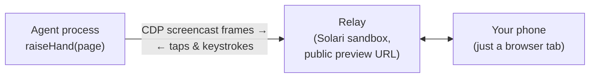

# handraise ✋

**When your agent gets stuck on a [Solari](https://getsolari.com) cloud
browser, let it ask a human — then continue from the exact same session.**

  

https://github.com/user-attachments/assets/76c64f8b-cdc1-4f13-bc6d-1839c0579f44


```sh
npm install handraise
```

```ts
import { Solari } from "@solarisdk/browser"
import { raiseHand } from "handraise"

const browser = await new Solari({ apiKey: process.env.SOLARI_API_KEY }).launch()
const page = await browser.newPage()
await page.goto("https://github.com/login")
// ... the agent fills the credentials, then hits the 2FA wall ...

const result = await raiseHand(page, { reason: "GitHub is asking for a 2FA code" })
// outcome "resolved" → the human typed the code on their phone, the agent is signed in
```

A QR code appears in the terminal. Scan it, and the live browser session is on
your phone — video, taps, typing, scrolling. Tap *Hand back* and `raiseHand`
returns. Set `SOLARI_API_KEY`; handraise uses it to create the relay sandbox.

- **Same browser session.** Same cookies, same page, no restart — the agent
  resumes exactly where it stopped.
- **Works from any phone, nothing to install there.** The handoff link is a
  URL; open it in the mobile browser that is already on the device.
- **No server to host.** The handoff UI runs on a Solari sandbox that handraise
  creates and destroys around the call.

Measured against the live API, method and raw data in
[`benchmarks/`](benchmarks/README.md):

- **19/20 blocked workflows rescued** (baseline 0/20).
- **30/30 handoffs resolved** in the latency benchmark.
- **3.5 s median** from raise to live on the phone.

## Approval mode

Sometimes the agent is not stuck — it is about to do something it may not
decide alone. That needs no takeover: the human sees a screenshot, the reason
and the exact step, and answers.

```ts
const answer = await raiseHand(page, {
  mode: "approval",
  reason: "The agent may not move money without a human",
  action: "Submit $12,430 vendor payment to Acme GmbH",
})
if (answer.outcome !== "approved") return   // "denied", "timeout", "disconnected"
```

One screenshot, no live stream, and nothing is injected into the page: the
agent still owns the session and carries out the action itself. (The event's
`framesSent` counts that screenshot once per connection — `1 + reconnects` —
because a reconnecting agent has to put it back on the wire.) On the phone,
**Deny is one tap** and **Approve takes a 700ms hold** — the reverse of
takeover mode, because here the answer that cannot be taken back is yes. The
relay enforces it too: an approval relay routes `approve` and `deny` and drops
every takeover message, so the restriction is not just a hidden button
([`docs/adr/0006`](docs/adr/0006-approval-mode.md)).

Upgrading from 0.3.0: nothing changes at runtime, and `raiseHand(page, { reason })`
compiles as it did. Three exported types changed shape, so a TypeScript
consumer may have one edit to make even if they never ask for an approval —
`HandoffOutcome` has two new members, `HandoffEvent.mode` is new and required,
and `RaiseHandOptions` is now a union (extend `HandoffOptions` or
`TakeoverOptions` instead of it). The
[CHANGELOG](CHANGELOG.md) has the detail.

## Channels

An approval is a screenshot, a sentence and two answers — which is a chat
message. A **channel** is an object handraise notifies when the handoff starts;
in approval mode it also gets the JPEG and can answer in-process, so nobody has
to open the link at all.

```ts
import { raiseHand } from "handraise"
import { telegram } from "handraise-telegram"

const { TELEGRAM_BOT_TOKEN = "", TELEGRAM_CHAT_ID = "" } = process.env

await raiseHand(page, {
  mode: "approval",
  reason: "The agent may not move money without a human",
  action: "Submit $12,430 vendor payment to Acme GmbH",
  channels: [telegram({ botToken: TELEGRAM_BOT_TOKEN, chatId: TELEGRAM_CHAT_ID })],
})
// The screenshot and two buttons arrive in the chat; the first answer wins,
// whether it comes from there or from the phone.
```

Write your own in about ten lines: `notify(handoff)` gets `handoffId`, `url`,
`reason`, `mode`, `settled` and — in approval mode — `action`, `screenshot` (the
same bytes the phone shows) and `answer("approve" | "deny")`, which returns
`false` if somebody was faster. `notify` is never awaited and whatever it throws
is one `channel_failed` warning: a chat API that is down costs you a
notification, not a browser session. Anyone who can see the channel can answer
it ([`docs/adr/0007`](docs/adr/0007-channels.md)).

**`settled` is how a channel knows it can stop.** It is a promise that resolves
with the outcome the moment the handoff ends — however it ended, including on
the phone or by timeout — and it never rejects:

```ts
const channel = {
  notify: async (handoff) => {
    const message = await post(handoff)
    const outcome = await Promise.race([waitForReply(message), handoff.settled])
    await close(message, outcome)
  },
}
```

Without it an adapter that waits for a reply can only stop on its own clock,
which means holding a connection open — and the process alive — long after
`raiseHand` has returned.

Runnable without writing any code: [`demo/try.ts`](demo/try.ts) raises a hand
immediately so you can drive it; [`demo/approval.ts`](demo/approval.ts) asks
you to approve a payment; [`demo/github-2fa.ts`](demo/github-2fa.ts) does the
real 2FA wall and keeps the session the handoff earned.

## What this actually is

handraise is a **resumable interrupt primitive for autonomous agents** — the
live view is just the implementation. The product is *interrupt → human
resolution → resume*. A live view shows you a browser; handraise gives the
agent a typed outcome it can branch on, and a session that survives the detour.

## Give it to your LLM agent

Your agent's loop already knows when it's stuck. Expose handraise as a tool and
let the model decide when to call for a human. No extra dependencies; the spec
is plain JSON Schema:

```ts
import { tool, jsonSchema } from "ai" // Vercel AI SDK
import { createNeedHumanTool, needHumanToolSpec, type NeedHumanInput } from "handraise"

const needHuman = createNeedHumanTool(page)

const tools = {
  needHuman: tool({
    description: needHumanToolSpec.description,
    inputSchema: jsonSchema<NeedHumanInput>(needHumanToolSpec.inputSchema),
    execute: needHuman,
  }),
}
```

The tool returns `{ outcome, summary, durationMs }`, where `summary` is a
sentence the model can act on ("A human fixed the problem and handed the
browser back. Re-read the page and continue.", or "The human refused the
action. Do not carry it out and do not ask again for the same step.").

The model also chooses the mode: it passes `mode: "approval"` plus an `action`
when it could do the step but must not decide alone, and the tool refuses an
approval that names no action rather than quietly handing the browser over.

[`demo/agent.ts`](demo/agent.ts) is a real agent loop where the model itself
decides to call `needHuman` when it hits the 2FA wall — run it with
`DEMO_SIM=1` for the scripted version.

**Two classes of interrupt, one call.** A *capability gap* — 2FA, a captcha, an
unfamiliar UI — is the agent admitting it cannot: `mode: "takeover"`, the
default. An *authority boundary* — a yes before an irreversible step — is the
agent not being allowed to: `mode: "approval"`. The model picks, by passing
`mode` and `action` to the same tool; the tool description says which is
which.

## How it works



The twist: **the handoff UI itself runs on Solari.** When the agent raises its
hand, handraise boots a Solari sandbox (~3s), deploys a zero-dependency relay
into it, and exposes it through Solari's port preview. Frames stream from the
browser's CDP screencast through the relay to your phone; your taps and
keystrokes stream back and are injected as trusted CDP input events. No tunnel
tool, no self-hosted server, no second account — the same API key that runs
your browser runs the escape hatch. The phone's end of it is a tokenized URL
served from `*.preview.getsolari.com`, and nothing else.

## What the human sees on the phone

The handoff link opens a dark, minimal page: the live browser session on top,
an input bar at the bottom. Tap the live view to click, drag to scroll. When
the agent reports which field has focus, the view **zooms to it** so it is
readable (remote 16px text renders at ~10px instead of ~5px), draws a ring
around it, and the bar names it ("Typing into: Verification code"). Pinch to
zoom and pan yourself; double-tap toggles between zoomed and fit. Typing goes
straight into the focused field, character by character — and if that field is
a one-time code, the phone offers the SMS code it just received.

Four keys under the input, because a phone's virtual keyboard cannot be trusted
to send them:

| Key | What it does |
|---|---|
| ⌫ | Delete one character in the remote field |
| ⇥ | Move to the next field |
| ⏎ | Submit / press Enter |
| Clear | Empty the focused field (select-all + backspace; disabled while nothing is focused, and kept well away from ⌫) |

Below that, two ways out. **✋ Hand back** ends the handoff as `resolved` — one
tap, the agent continues. **I can't do this** ends it as `aborted` — the agent
is told a human looked and could not solve it, so it should not retry the same
step; it takes a 700ms hold, because it is irreversible and sits next to the
primary. The dot in the header shows the connection: white is live, pulsing
grey is reconnecting (your input is queued and sent in order once it is back),
red means the handoff has ended.

**In approval mode the same page has a different job.** One screenshot instead
of the stream, the action in the largest type on the screen, and no keyboard,
key bar or input row — nothing there can reach the remote page. Pinch, drag and
double-tap still zoom and pan the screenshot, because an amount you cannot read
is an approval you cannot give. **Deny** is one tap and **Hold to approve**
takes the 700ms; the ending says which one happened.

## Getting notified

Four ways, no vendor lock-in:

- **QR code in the terminal** (default) — scan with the phone camera.
- **`onUrl` callback** — do whatever you want with the link.
- **`webhookUrl`** — handraise POSTs `{ url, reason, mode, action?, sessionId }`
  as JSON (`action` only in approval mode).
  Point it at Slack, Discord, ntfy, a Telegram bot — anything that accepts a
  POST.
- **`channels`** — the only one that can carry the screenshot and bring an
  answer back. See [Channels](#channels).

```ts
await raiseHand(page, {
  reason: "Captcha needs a human",
  webhookUrl: process.env.SLACK_WEBHOOK_URL,
  qr: false,
})
```

## API

### `raiseHand(page, options): Promise<HandoffResult>`

| Option | Type | Default | |
|---|---|---|---|
| `reason` | `string` | *required* | Shown to the human on the handoff page. |
| `mode` | `"takeover"` \| `"approval"` | `"takeover"` | `takeover` hands the live browser over; `approval` shows one screenshot and asks for a yes or a no. |
| `action` | `string` | *required in approval mode* | The exact step being decided, e.g. "Submit $12,430 vendor payment to Acme GmbH". A type error if `mode` is `"approval"` and it is missing. |
| `timeoutMs` | `number` | 5 minutes | How long to wait for the human. |
| `webhookUrl` | `string` | — | Generic JSON POST when the link is ready. |
| `onUrl` | `(url) => void` | — | Called with the handoff URL. |
| `channels` | `HandoffChannel[]` | — | Where else to announce it. In approval mode a channel also gets the screenshot and can answer. See [Channels](#channels). |
| `qr` | `boolean` | `true` | Print a QR code to the terminal. |
| `apiKey` | `string` | `$SOLARI_API_KEY` | Solari key used to create the relay sandbox. |
| `logger` | `Logger` | warn/error only | Structured logging sink. Pass `consoleLogger` for full JSON lines incl. the per-handoff wide event. |
| `onEvent` | `(e: HandoffEvent) => void` | — | One wide event per handoff (outcome, timings, ids). |
| `baseUrl` | `string` | — | Solari endpoint/region for the relay sandbox. |

### `HandoffResult`

| Field | |
|---|---|
| `outcome` | See below. |
| `durationMs` | Wall-clock time the human took. |
| `url` | The handoff URL. |
| `storageState` | Cookies + localStorage captured right after a successful handback — persist it (e.g. to a Solari profile) and the human's work survives even if the session dies later. Takeover mode only: an approval changes nothing on the page. |

| `outcome` | Mode | Means |
|---|---|---|
| `resolved` | takeover | The human handed the browser back. |
| `aborted` | takeover | The human looked and could not solve it. Do not retry the same step. |
| `approved` | approval | Carry out the action. |
| `denied` | approval | Do not carry out the action. |
| `timeout` | both | Nobody answered within `timeoutMs`. |
| `disconnected` | both | The browser session died mid-handoff. |

### Errors

`raiseHand` throws only before the handoff URL exists — while nobody has been
asked for anything yet. Everything after that is an `outcome`, never an
exception. What it throws is a `HandraiseError` with a `code`: the code is the
contract, the message is for whoever reads the log and may be reworded in any
release. `isHandraiseError` narrows a `catch` binding, and `cause` keeps the
original SDK, CDP or network error whenever there was one — the same class,
`name`, `status` and `code`, its own non-enumerable properties, and its own
`cause` chain — with credentials redacted out of every `message`, `stack` and
response body along it. Every error serialiser prints the whole chain, so a
clean outer message on its own would not be worth much.

The first thing `raiseHand` does is look at your page, before it creates
anything: a page you have closed, or a browser you have disconnected, is
refused as `browser_unusable` rather than paid for with a relay sandbox and a
person's attention. It reads local state only, so a Solari session that has
died server-side while the CDP socket is still open still looks alive — that
one arrives as the `disconnected` outcome, as it always did.

```ts
import { isHandraiseError, raiseHand } from "handraise"

try {
  await raiseHand(page, { reason: "GitHub is asking for a 2FA code" })
} catch (error) {
  if (isHandraiseError(error) && error.code === "concurrency_limit") {
    // one Solari session too many: free one, then call again
  }
}
```

| `code` | Happens when | What to do |
|---|---|---|
| `missing_api_key` | No `options.apiKey` and no `SOLARI_API_KEY`. | Set one; handraise needs it to create the relay sandbox. |
| `invalid_mode` | `mode` is neither `"takeover"` nor `"approval"`. | Fix the call. TypeScript already refuses it; this is for JavaScript callers. |
| `empty_action` | `mode: "approval"` without a non-empty `action`. | Name the step the human says yes or no to. |
| `browser_unusable` | The page is closed, or its browser has disconnected — checked before anything is created. | Open a new page or relaunch the session (restore `storageState` if you kept it) and retry. |
| `relay_start_failed` | The relay sandbox could not be created or deployed. | Read `cause` — it is the Solari SDK's own error, redacted. Retry. Nothing is left behind unless you also see `relay_release_failed` (below). |
| `concurrency_limit` | Your Solari account is at its concurrent session cap (429). | Free a session, or wait and retry. The one relay failure that is purely temporary. |
| `relay_not_ready` | The sandbox started but its public URL never answered. | Retry. Persisting means the preview proxy or the region is unhealthy. |

There is deliberately no code for the one failure that is not the caller's to
catch: a relay sandbox that survives its own teardown. `raiseHand` logs
`relay_release_failed` and carries on — after a successful handoff it returns
the outcome, and on a failed start it still throws `relay_start_failed`. Either
way that sandbox's public URL stays reachable until its idle timeout, so watch
for that log line and delete it from the Solari dashboard.

## What happens when things die

A handoff tool that loses your session at the worst moment is worse than no
tool, so every row here is measured rather than hoped for.

| Failure | Outcome |
|---|---|
| Human never shows | Clean `timeout`, relay destroyed |
| Browser session dies mid-handoff | `disconnected`, not an exception |
| Relay WebSocket drops | 20s heartbeats, reconnect, last frame replayed |
| Agent process killed | Sandbox lifecycle kill, no orphaned URL |
| Link holder tries the agent role | `401`, roles are separate credentials |

The load-bearing fact is the platform's: Solari browser sessions die ~10
minutes after creation whatever you do, and the sessions API still calls a dead
one `active` ([we measured
it](docs/measurements/04-browser-session-lifetime.md)) — hence the 5-minute
default, no keep-alive pinger, and `storageState` on the result. Every exit
path, errors included, destroys the relay sandbox before `raiseHand` returns:
one handoff, one sandbox. The rejected alternatives are in
[`docs/adr/`](docs/adr/).

## How this compares

Human-in-the-loop for cloud browsers isn't new — that's the point, the demand is
proven. Browserbase Live View, Cloudflare Browser Run, Scrapfly and AuthLoop are
hosted platform features of their own clouds; if you run on one, use theirs.
handraise brings the same handoff to Solari browsers, which have no native live
view (Solari's VNC is desktop-only), as a portable library instead — less
polished, and it works where those don't. What the hosted live views do not
have is the second mode: an approval is a yes-or-no on one screenshot, no
live session exposed at all, answerable from a chat channel. Its scope stops
at the handoff, not wall detection
([`docs/adr/0005`](docs/adr/0005-handoff-not-wall-detection.md)).

## Security

- **The handoff link is a bearer URL scoped to one relay:** a preview token for
  that one sandbox and port, 1-hour lifetime, destroyed with the sandbox.
- **The agent role is a separate secret**, never in the link. Only its holder
  can read keystrokes and drive the browser; a foreign `Origin` is refused.
- **Frames and keystrokes are never persisted**, and the human side speaks a
  closed, length- and rate-bounded message set — there is no path from the link
  to arbitrary browser control. Your API key never leaves the agent process.

Threat model, scope and reporting: [`SECURITY.md`](SECURITY.md).

## Measured

`bun run bench`: 30 consecutive real handoffs against the live API on the $20
Solari plan, one fresh relay sandbox each, a scripted human on the public
WebSocket, measured from Germany against the default (us-west) endpoint.
**30/30 resolved, zero reconnects, zero leaked sandboxes.**

| | p50 | p75 | worst of 30 |
|---|---|---|---|
| Agent raises its hand → the phone shows the live page | 3.5s | 3.6s | 3.7s |
| — of which: relay sandbox cold start | 2.7s | 2.7s | 2.9s |
| Input round trip through the relay (150 samples) | 186ms | 191ms | 286ms |

The number that matters more than any latency is what handraise does to
workflows that would otherwise fail. `bun run bench:rescue`: 40 runs against a
live portal with a real TOTP wall, interleaved arms, one completion test:

| | completed | median human time |
|---|---|---|
| baseline agent (no human available) | 0/20 | — |
| with handraise | **19/20** | 5.5s |

The 0/20 baseline is the design fact, not a crippled agent: it tried, and a
machine cannot know a TOTP code. The 5.5s is a scripted human — the machine
floor of a handoff, not reading speed. The one failure was the platform's
~10min session death landing mid-handoff; handraise reported `disconnected`
instead of claiming success.

At N=30 the right-hand column is the worst observation, not a fitted p99 — we
say what we measured. The input round trip sits on the network RTT floor from
Germany to the us-west edge (pass `baseUrl` to co-locate the relay with your
region), and cold start is ~75% of time-to-visible, which is why a warm relay
is the next performance lever. Live view costs 23–80 KB/s while a human solves
a 2FA, and each handoff consumes one sandbox, destroyed when it ends.

## Verified how

Benchmark method and raw data: [`benchmarks/`](benchmarks/README.md). The four
platform measurements the design rests on — transport, screencast, input
injection, session lifetime — are in
[`docs/measurements/`](docs/measurements/README.md). The e2e test drives the
whole loop with no mocks: a Solari browser signs into a TOTP-protected demo app
([`test-app/`](test-app/), deployed into a sandbox), hits the 2FA wall, raises
its hand, a scripted "human" types the code through the real handoff UI, and
the test asserts the signed-in page — ~6s end to end. Injected events arrive
with `isTrusted: true`.

## Limitations (v1)

- If the human silently closes the tab, the agent can't tell — it waits until
  `timeoutMs`. (The relay answers heartbeats itself; peer presence is a v2
  protocol change.)
- Solari's $20 plan allows 2 concurrent sandboxes; each active handoff uses
  one. Two simultaneous handoffs is the plan-tier ceiling.
- An approval shows the page as it was when the agent asked. If the page
  changes underneath (a session expiring, a redirect), the human is deciding on
  a stale picture — the frame is not refreshed.
- A verification that shows a QR code to scan (reCAPTCHA's "scan to verify
  you're human") needs a second screen today: open the handoff link on a
  laptop and scan it with the phone — the phone cannot scan its own display.
  Decoding the QR from the live frame and handing the phone the link is
  planned.
- TypeScript/Node only for now.

## Contributing

Small, focused PRs welcome. Good first issues: a Python port, a
`needHuman` tool export for more agent frameworks, wall-detection heuristics,
peer-presence in the relay protocol.

MIT
