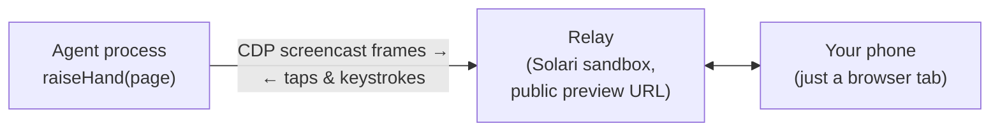

# handraise ✋

**When your agent gets stuck on a [Solari](https://getsolari.com) cloud
browser, let it ask a human — then continue from the exact same session.**

  

https://github.com/user-attachments/assets/76c64f8b-cdc1-4f13-bc6d-1839c0579f44


```sh
npm install handraise
```

```ts
import { Solari } from "@solarisdk/browser"
import { raiseHand } from "handraise"

const browser = await new Solari({ apiKey: process.env.SOLARI_API_KEY }).launch()
const page = await browser.newPage()
await page.goto("https://github.com/login")
// ... the agent fills the credentials, then hits the 2FA wall ...

const result = await raiseHand(page, { reason: "GitHub is asking for a 2FA code" })
// outcome "resolved" → the human typed the code on their phone, the agent is signed in
```

A QR code appears in the terminal. Scan it, and the live browser session is on
your phone — video, taps, typing, scrolling. Tap *Hand back* and `raiseHand`
returns. Set `SOLARI_API_KEY`; handraise uses it to create the relay sandbox.

- **Same browser session.** Same cookies, same page, no restart — the agent
  resumes exactly where it stopped.
- **Works from any phone, nothing to install there.** The handoff link is a
  URL; open it in the mobile browser that is already on the device.
- **No server to host.** The handoff UI runs on a Solari sandbox that handraise
  creates and destroys around the call.

Runnable without writing any code: [`demo/try.ts`](demo/try.ts) raises a hand
immediately so you can drive it; [`demo/github-2fa.ts`](demo/github-2fa.ts)
does the real 2FA wall and keeps the session the handoff earned.

## What this actually is

handraise is a **resumable interrupt primitive for autonomous agents** — the
live view is just the implementation. The product is *interrupt → human
resolution → resume*. A live view shows you a browser; handraise gives the
agent a typed outcome it can branch on, and a session that survives the detour.

## Give it to your LLM agent

Your agent's loop already knows when it's stuck. Expose handraise as a tool and
let the model decide when to call for a human. No extra dependencies; the spec
is plain JSON Schema:

```ts
import { tool, jsonSchema } from "ai" // Vercel AI SDK
import { createNeedHumanTool, needHumanToolSpec, type NeedHumanInput } from "handraise"

const needHuman = createNeedHumanTool(page)

const tools = {
  needHuman: tool({
    description: needHumanToolSpec.description,
    inputSchema: jsonSchema<NeedHumanInput>(needHumanToolSpec.inputSchema),
    execute: needHuman,
  }),
}
```

The tool returns `{ outcome, summary, durationMs }`, where `summary` is a
sentence the model can act on ("A human fixed the problem and handed the
browser back. Re-read the page and continue.").

[`demo/agent.ts`](demo/agent.ts) is a real agent loop where the model itself
decides to call `needHuman` when it hits the 2FA wall — run it with
`DEMO_SIM=1` for the scripted version.

**Two classes of interrupt, one call.** A *capability gap* — 2FA, a captcha, an
unfamiliar UI — is the agent admitting it cannot. An *authority boundary* —
approval before an irreversible step — is the agent choosing not to. Both are
the same call today with a different `reason`.

## How it works



The twist: **the handoff UI itself runs on Solari.** When the agent raises its
hand, handraise boots a Solari sandbox (~3s), deploys a zero-dependency relay
into it, and exposes it through Solari's port preview. Frames stream from the
browser's CDP screencast through the relay to your phone; your taps and
keystrokes stream back and are injected as trusted CDP input events. No tunnel
tool, no self-hosted server, no second account — the same API key that runs
your browser runs the escape hatch. The phone's end of it is a tokenized URL
served from `*.preview.getsolari.com`, and nothing else.

## What the human sees on the phone

The handoff link opens a dark, minimal page: the live browser session on top,
one input bar at the bottom. Tap the live view to click; drag to scroll. A
ring marks the field that currently has focus, and the bar names it
("Typing into: Password") — typing goes straight into that field, character by
character.

Four keys sit next to the input, because a phone's virtual keyboard cannot be
trusted to send them:

| Key | What it does |
|---|---|
| ⌫ | Delete one character in the remote field |
| ✕ | Clear the focused field (select-all + backspace; disabled while nothing is focused) |
| ⇥ | Move to the next field |
| ⏎ | Submit / press Enter |

Below that, two ways out: **✋ Hand back to agent** ends the handoff as
`resolved` — the agent continues. **Can't help** ends it as `aborted` — the
agent is told a human looked and could not solve it, so it should not retry
the same step. The dot in the header shows the connection: white is live, grey
is reconnecting, red means the handoff has ended.

## Getting notified

Three ways, no vendor lock-in:

- **QR code in the terminal** (default) — scan with the phone camera.
- **`onUrl` callback** — do whatever you want with the link.
- **`webhookUrl`** — handraise POSTs `{ url, reason, sessionId }` as JSON.
  Point it at Slack, Discord, ntfy, a Telegram bot — anything that accepts a
  POST.

```ts
await raiseHand(page, {
  reason: "Captcha needs a human",
  webhookUrl: process.env.SLACK_WEBHOOK_URL,
  qr: false,
})
```

## API

### `raiseHand(page, options): Promise<HandoffResult>`

| Option | Type | Default | |
|---|---|---|---|
| `reason` | `string` | *required* | Shown to the human on the handoff page. |
| `timeoutMs` | `number` | 5 minutes | How long to wait for the human. |
| `webhookUrl` | `string` | — | Generic JSON POST when the link is ready. |
| `onUrl` | `(url) => void` | — | Called with the handoff URL. |
| `qr` | `boolean` | `true` | Print a QR code to the terminal. |
| `apiKey` | `string` | `$SOLARI_API_KEY` | Solari key used to create the relay sandbox. |
| `logger` | `Logger` | warn/error only | Structured logging sink. Pass `consoleLogger` for full JSON lines incl. the per-handoff wide event. |
| `onEvent` | `(e: HandoffEvent) => void` | — | One wide event per handoff (outcome, timings, ids). |
| `baseUrl` | `string` | — | Solari endpoint/region for the relay sandbox. |

### `HandoffResult`

| Field | |
|---|---|
| `outcome` | `"resolved"` \| `"aborted"` \| `"timeout"` \| `"disconnected"` |
| `durationMs` | Wall-clock time the human took. |
| `url` | The handoff URL. |
| `storageState` | Cookies + localStorage captured right after a successful handback — persist it (e.g. to a Solari profile) and the human's work survives even if the session dies later. |

## What happens when things die

This is the part we sweated, because a handoff tool that loses your session at
the worst moment is worse than no tool.

| Failure | Outcome |
|---|---|
| Human never shows | Clean `timeout`, relay destroyed |
| Browser session dies mid-handoff | `disconnected`, not an exception |
| Relay WebSocket drops | 20s heartbeats, reconnect, last frame replayed |
| Agent process killed | Sandbox lifecycle kill, no orphaned URL |
| Link holder tries the agent role | `401`, roles are separate credentials |

- **Human never shows up** → `outcome: "timeout"` after `timeoutMs`; **Human
  hits Abort** → `outcome: "aborted"`. Either way the relay sandbox is
  destroyed and the agent keeps its browser and decides what's next.
- **The browser session dies mid-handoff** → `outcome: "disconnected"`, not an
  exception. We measured Solari browser sessions dying ~10 minutes after
  creation regardless of activity (no keep-alive extends it, and the sessions
  API keeps reporting them as `active` after death — liveness comes from the
  connection, never the control plane). That's why the default wait is 5
  minutes, why there is deliberately no keep-alive pinger, and why
  `storageState` exists on the result.
- **The agent process is killed mid-handoff** → the relay sandbox is created
  with `lifecycle: { onTimeout: "kill" }` and a bounded idle window, so it
  destroys itself; no zombie infrastructure, no orphaned public URL.
- **The relay WebSocket drops** → Solari's preview proxy kills idle sockets
  after exactly 60s, so both ends heartbeat every 20s and treat close code
  1006 as "reconnect", not "failed". The relay replays the last frame to a
  late-joining phone — and stops replaying it the moment the handoff ends, so
  whoever opens the link afterward sees the ending, not the logged-in page.
- **After every outcome** — including errors — the relay sandbox is destroyed
  before `raiseHand` returns, with the deletion confirmed and retried on
  transient failure. One handoff, one sandbox.

## How this compares

Human-in-the-loop for cloud browsers isn't new — that's the point. The demand is
proven, and handraise brings the same escape hatch to a runtime that doesn't have
one yet.

- **Browserbase Live View, Cloudflare Browser Run, Scrapfly, AuthLoop** are
  platform features of their own clouds — a live-view panel or a session-takeover
  flow baked into the service that runs your browser. They're hosted, mature, and
  supported by the vendor. If you already run on one of those, use theirs.
- **handraise** brings the same handoff to **Solari** browsers, which have no
  native live view (Solari's VNC is desktop-only) — as a small, self-contained,
  open-source library rather than a platform feature.

The honest trade-off: the platform solutions are more polished and fully hosted;
handraise is lightweight and portable, and it works where those don't. Its scope
is deliberately narrow — the handoff muscle, not wall detection (see
[`docs/adr/0005`](docs/adr/0005-handoff-not-wall-detection.md)).

## Security

- The handoff URL contains a Solari preview token scoped to that one sandbox
  and port, with a 1-hour lifetime. When the handoff ends, the sandbox — and
  with it the URL — is destroyed.
- **The agent role is a separate credential, not the handoff link.** Anyone
  with the phone link can view and solve; only a client holding a per-handoff
  secret (minted by `startRelay`, appended only to the agent's own URL) may
  connect as the agent that reads keystrokes and drives the browser. A foreign
  `Origin` is refused, so the preview cookie can't be ridden from another page.
- **The relay is a dumb router with a closed message set.** The human side can
  send taps, characters, a few named keys, scroll, hand-back and abort — and
  nothing else; there is no path from the link to arbitrary browser control.
  Inputs are length- and rate-bounded.
- **No frame or keystroke data is stored or persisted.** The relay keeps only
  the latest frame in memory to paint a late-joining phone, and drops it when
  the handoff ends. It logs connection events (not their contents) inside the
  sandbox, which is destroyed at the end.
- Your Solari API key never leaves the agent process. The phone only ever
  sees the preview URL.

## Measured

Benchmarked with the shipped harness (`bun run bench`): 30 consecutive real
handoffs against the live API on the $20 Solari plan, one fresh relay sandbox
each, a scripted human on the public WebSocket, measured from Germany against
the default (us-west) endpoint. **30/30 resolved, zero reconnects, zero
leaked sandboxes.** Raw per-run data: [`spikes/bench-results.json`](spikes/bench-results.json).

| | p50 | p75 | worst of 30 |
|---|---|---|---|
| Agent raises its hand → the phone shows the live page | 3.5s | 3.6s | 3.7s |
| — of which: relay sandbox cold start | 2.7s | 2.7s | 2.9s |
| Input round trip through the relay (150 samples) | 186ms | 191ms | 286ms |

And the number that matters more than any latency — what handraise does to
workflows that would otherwise fail. 40 runs against a live portal with a real
TOTP wall, interleaved arms, same completion test on both:

| | completed | median human time |
|---|---|---|
| baseline agent (no human available) | 0/20 | — |
| with handraise | **19/20** | 5.5s |

Of 20 workflows blocked on a human-only wall, handraise rescued 19. The 0/20
baseline is the design fact, not a crippled agent: it tried, and a machine
cannot know a TOTP code. The 5.5s is a scripted human — the machine floor of
the handoff, not human reading speed. The one failure was the platform's ~10min
session death landing mid-handoff; handraise reported `disconnected` instead of
claiming success. Raw data: [`spikes/rescue-results.json`](spikes/rescue-results.json).

At N=30 the right-hand column is the worst observation, not a fitted p99 — we
say what we measured. The input round trip sits on the network RTT floor from
Germany to the us-west edge; the relay itself adds nothing measurable (pass
`baseUrl` to co-locate the relay with your region). Cold start is ~75% of
time-to-visible, which is why a warm-relay option is the roadmap's next
performance lever.

Additional context: live-view bandwidth while a human solves a 2FA runs
23–80 KB/s; the full e2e — sign-in wall, handoff, a scripted human typing a
TOTP code, signed-in assertion — completes in ~6s; each handoff consumes one
sandbox, destroyed when it ends.

## Verified how

Every claim above comes from measurements against the real API — the spike
reports with raw numbers are in [`spikes/`](spikes/). The e2e test drives the
whole loop with no mocks: a Solari browser signs into a TOTP-protected demo
app ([`test-app/`](test-app/), deployed into a sandbox), hits the 2FA wall,
raises its hand, a scripted "human" types the code through the real handoff
UI, and the test asserts the signed-in page. Injected events arrive with
`isTrusted: true`.

## Limitations (v1)

- If the human silently closes the tab, the agent can't tell — it waits until
  `timeoutMs`. (The relay answers heartbeats itself; peer presence is a v2
  protocol change.)
- Solari's $20 plan allows 2 concurrent sandboxes; each active handoff uses
  one. Two simultaneous handoffs is the plan-tier ceiling.
- TypeScript/Node only for now.

## Contributing

Small, focused PRs welcome. Good first issues: a Python port, a
`needHuman` tool export for more agent frameworks, wall-detection heuristics,
peer-presence in the relay protocol.

MIT
