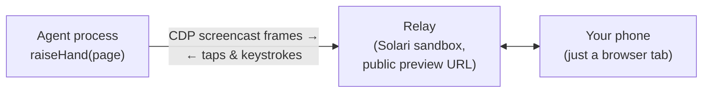

# handraise ✋

**Human-in-the-loop handoff for [Solari](https://getsolari.com) cloud browsers.**

Your agent already knows when it's stuck. handraise lets it raise its hand: the
browser session appears live on your phone, you solve the 2FA prompt (or the
captcha it couldn't, or the dialog it doesn't understand), tap *Hand back*, and
the agent continues — same session, same cookies, no restart.

> 🎬 *Demo clip coming here.*

```ts
import { Solari } from "@solarisdk/browser"
import { raiseHand } from "handraise"

const browser = await new Solari({ apiKey }).launch()
const page = await browser.newPage()

await page.goto("https://github.com/login")
// ... agent fills credentials, then hits the 2FA wall ...

const result = await raiseHand(page, {
  reason: "GitHub is asking for a 2FA code",
})

if (result.outcome === "resolved") {
  // the human typed the code on their phone; the agent is signed in
}
```

When `raiseHand` runs, a QR code appears in your terminal. Scan it and the
live browser session is on your phone — video, taps, typing, scrolling.

## How it works



The twist: **the handoff UI itself runs on Solari.** When the agent raises its
hand, handraise boots a Solari sandbox (~3s), deploys a zero-dependency relay
into it, and exposes it through Solari's port preview. Frames stream from the
browser's CDP screencast through the relay to your phone; your taps and
keystrokes stream back and are injected as trusted CDP input events. No tunnel
tool, no self-hosted server, no second account — the same API key that runs
your browser runs the escape hatch.

Your phone needs nothing installed. The handoff link is a tokenized URL served
from `*.preview.getsolari.com`; open it in any mobile browser.

## Install

```sh
npm install handraise
```

## Getting notified

Three ways, no vendor lock-in:

- **QR code in the terminal** (default) — scan with the phone camera.
- **`onUrl` callback** — do whatever you want with the link.
- **`webhookUrl`** — handraise POSTs `{ url, reason, sessionId }` as JSON.
  Point it at Slack, Discord, ntfy, a Telegram bot — anything that accepts a
  POST.

```ts
await raiseHand(page, {
  reason: "Captcha needs a human",
  webhookUrl: process.env.SLACK_WEBHOOK_URL,
  qr: false,
})
```

## API

### `raiseHand(page, options): Promise<HandoffResult>`

| Option | Type | Default | |
|---|---|---|---|
| `reason` | `string` | *required* | Shown to the human on the handoff page. |
| `timeoutMs` | `number` | 5 minutes | How long to wait for the human. |
| `webhookUrl` | `string` | — | Generic JSON POST when the link is ready. |
| `onUrl` | `(url) => void` | — | Called with the handoff URL. |
| `qr` | `boolean` | `true` | Print a QR code to the terminal. |

### `HandoffResult`

| Field | |
|---|---|
| `outcome` | `"resolved"` \| `"aborted"` \| `"timeout"` \| `"disconnected"` |
| `durationMs` | Wall-clock time the human took. |
| `url` | The handoff URL. |
| `storageState` | Cookies + localStorage captured right after a successful handback — persist it (e.g. to a Solari profile) and the human's work survives even if the session dies later. |

## What happens when things die

This is the part we sweated, because a handoff tool that loses your session at
the worst moment is worse than no tool.

- **Human never shows up** → `outcome: "timeout"` after `timeoutMs`. The relay
  sandbox is destroyed, the agent keeps its browser and decides what's next.
- **Human hits Abort** → `outcome: "aborted"`, same cleanup.
- **The browser session dies mid-handoff** → `outcome: "disconnected"`, not an
  exception. We measured Solari browser sessions dying ~10 minutes after
  creation regardless of activity (no keep-alive extends it, and the sessions
  API keeps reporting them as `active` after death — liveness comes from the
  connection, never the control plane). That's why the default wait is 5
  minutes, why there is deliberately no keep-alive pinger, and why
  `storageState` exists on the result.
- **The agent process is killed mid-handoff** → the relay sandbox has its own
  idle timeout and self-destructs; no zombie infrastructure, no orphaned
  public URL.
- **The relay WebSocket drops** → Solari's preview proxy kills idle sockets
  after exactly 60s, so both ends heartbeat every 20s and treat close code
  1006 as "reconnect", not "failed". The relay replays the last frame to a
  late-joining phone.
- **After every outcome** — including errors — the relay is destroyed before
  `raiseHand` returns. One handoff, one sandbox, cents.

## Security

- The handoff URL contains a Solari preview token scoped to that one sandbox
  and port, with a 1-hour lifetime. When the handoff ends, the sandbox — and
  with it the URL — is destroyed.
- The relay accepts one agent and one human connection; a new human connection
  replaces the old one.
- The relay is a dumb router. Frames and keystrokes pass through it; nothing
  is stored, nothing is logged, nothing persists after the sandbox dies.
- Your Solari API key never leaves the agent process. The phone only ever
  sees the preview URL.

## Measured

On the $20 Solari plan, from Europe:

| | |
|---|---|
| Raise → phone sees the live session | ~3s (sandbox cold start) + first frame ~200–300ms |
| Live view bandwidth while a human solves 2FA | 23–80 KB/s |
| Input round trip (tap on phone → click in browser) | ~1 RTT (the relay adds nothing measurable) |
| Cost per handoff | one sandbox for the duration of the handoff — cents |

## Verified how

Every claim above comes from measurements against the real API — the spike
reports with raw numbers are in [`spikes/`](spikes/). The e2e test drives the
whole loop with no mocks: a Solari browser signs into a TOTP-protected demo
app ([`test-app/`](test-app/), deployed into a sandbox), hits the 2FA wall,
raises its hand, a scripted "human" types the code through the real handoff
UI, and the test asserts the signed-in page. Injected events arrive with
`isTrusted: true`.

## Limitations (v1)

- If the human silently closes the tab, the agent can't tell — it waits until
  `timeoutMs`. (The relay answers heartbeats itself; peer presence is a v2
  protocol change.)
- Solari's $20 plan allows 2 concurrent sandboxes; each active handoff uses
  one. Two simultaneous handoffs is the plan-tier ceiling.
- TypeScript/Node only for now.

## Contributing

Small, focused PRs welcome. Good first issues: a Python port, a
`needHuman` tool export for more agent frameworks, wall-detection heuristics,
peer-presence in the relay protocol.

MIT
